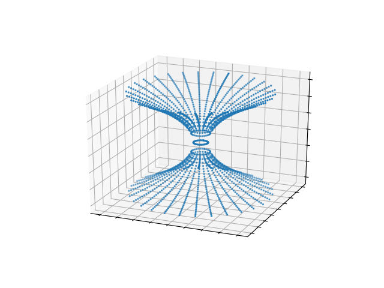

# Wormhole-Visualization
This is a simple Python visualization of a Wormhole using numpy and matplotlib. 

## Dependencies
* matplotlib
* numpy

## Usage
`python3 WormholeVisualization.py`

## Parameters
Parameters of the visualization can be changed inside WormholeVisualization.py.
